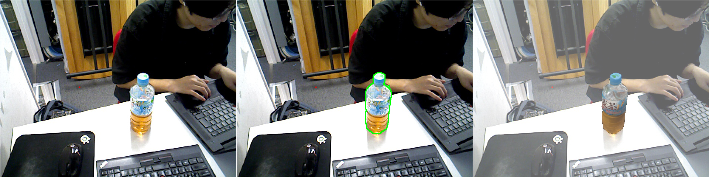

# PoseEstimation.

6D Pose Estimation Models Wrapper including [MegaPose](https://github.com/megapose6d/megapose6d.git), [FoundationPose](https://github.com/NVlabs/FoundationPose.git).

## Installation
```bash
# Create conda environment
# Make sure you cuda is in your $PATH
conda create -n pose-env python=3.9 -y
conda activate pose-env
conda install eigen=3.4.0 pybind11 -c conda-forge -y

# Run prepare script
EIGEN_INCLUDE=$CONDA_PREFIX/include/eigen3 CMAKE_PREFIX_PATH=$CONDA_PREFIX/lib/python3.9/site-packages/pybind11/share/cmake/pybind11:$CONDA_PREFIX/include/eigen3 ./prepare.sh
```

### MegaPose (RGB Only Mode)

